# Forensic Investigation Report

### Azure Managed Identity Compromise, Lateral Movement, and Data Exfiltration
**A Simulated Incident for SIEM/EDR Detection Validation**

Environment: Lab / Non-production Azure subscription (sanitized) · Classification: Internal / Training Exercise · September 2026

---

## Table of Contents

1. [Introduction](#1-introduction)
2. [Scenario Overview](#2-scenario-overview)
3. [Environment Setup](#3-environment-setup)
4. [Attack Execution](#4-attack-execution)
5. [Evidence Capture](#5-evidence-capture)
6. [Master Timeline (Correlated)](#6-master-timeline-correlated)
7. [MITRE ATT&CK Mapping](#7-mitre-attck-mapping)
8. [Detection Gap Analysis](#8-detection-gap-analysis)
9. [Indicators of Compromise (IOCs)](#9-indicators-of-compromise-iocs)
10. [Chain of Custody](#10-chain-of-custody)
11. [Recommendations](#11-recommendations)
12. [Conclusion](#12-conclusion)

---

## 1. Introduction

This report documents a simulated security incident in an Azure environment, designed to evaluate and validate the detection and response capabilities of a SIEM/EDR stack. The scenario stems from a common misconfiguration: a managed identity granted Contributor permissions at the subscription level instead of being scoped to its intended resource group.

An attacker exploits a remote code execution vulnerability in an outdated Apache HTTP Server (CVE-2021-41773 / CVE-2021-42013) to gain initial access to a virtual machine, then steals the attached managed identity's OAuth token via the Azure Instance Metadata Service (IMDS). Using that token, the attacker performs reconnaissance, moves laterally to a second resource, establishes independent persistence, and exfiltrates data to an external destination.

The objective of this exercise is to reconstruct the full chain of events through forensic analysis of memory, disk, and cloud logs, and to assess which detections fired — and how late — relative to the actual attack timeline.

## 2. Scenario Overview

The lab environment consists of a single Azure subscription containing the vulnerable virtual machine, the misconfigured user-assigned managed identity, and a second resource used as the lateral movement target. All resources, names, and identifiers in this report have been sanitized; the environment was built intentionally vulnerable for this exercise and does not reflect a production tenant.

### 2.1 Attack Narrative

1. Exploit the Apache RCE (CVE-2021-41773/42013) to obtain a shell on the target virtual machine.
2. Query the Azure Instance Metadata Service from that shell to steal the managed identity's OAuth token.
3. Use the token to enumerate accessible resources across the subscription.
4. Pivot to a second resource, reachable only because of the identity's excessive Contributor scope.
5. Establish persistence that is independent of the original stolen token.
6. Exfiltrate a file to an external destination.

### 2.2 Scope and Assumptions

All actions took place in a controlled, single-tenant lab. Timestamps are lab-local unless otherwise noted. Attacker actions were self-documented in real time, serving as ground truth for the forensic timeline reconstructed later in this report.

## 3. Environment Setup

The lab environment was built in Azure to support the full attack and detection chain described in this report.

### 3.1 Identity and Access Configuration

A user-assigned managed identity was created as a standalone Azure resource. This identity was granted the Contributor role at the subscription scope via Access Control (IAM), rather than being limited to a single resource group — this is the deliberate misconfiguration at the center of the scenario.

### 3.2 Target Virtual Machines (vm-web / vm-web2)

An Ubuntu virtual machine was deployed and configured with:

- The user-assigned managed identity attached during creation.
- Apache HTTP Server pinned to version 2.4.49, with the CGI configuration required to expose CVE-2021-41773/42013.
- Sysmon for Linux (or auditd) installed and configured to log process creation, network connections, and file activity.
- An EDR agent installed and forwarding telemetry to the existing SIEM.

### 3.3 Secondary Resource (Lateral Movement Target)

A second resource (vm-db) — deployed in a separate resource group within the same subscription — was used as the target reachable only through the identity's over-broad permissions. A file representing "sensitive data" was placed here in advance to support the later exfiltration step.

### 3.4 Logging and Monitoring

Diagnostic settings were enabled on the subscription and relevant resources to ensure Activity Log, Microsoft Entra sign-in logs, and Entra audit logs were captured and exported for the incident window. All logging was verified as functional prior to executing the attack, to preserve evidence integrity for the exercise.

## 4. Attack Execution

### 4.1 Initial Access — Apache RCE

The attacker exploited the Apache path-traversal / RCE vulnerability (CVE-2021-41773/42013) against the vulnerable web host (**vm-web2**) to obtain a reverse shell as the low-privileged web service account, with the listener caught from the operator console (**vm-web**).

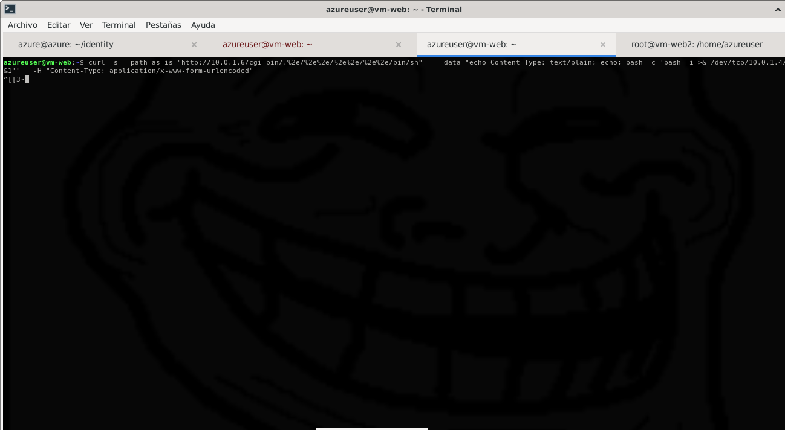
*Figure 1. Reverse-shell payload sent to the vulnerable Apache CGI path exposed on vm-web2.*

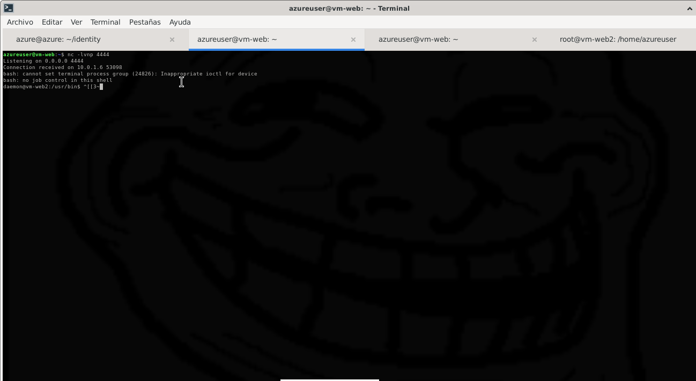
*Figure 2. Reverse shell received on the listener, landing as the daemon service account on vm-web2.*

### 4.2 Credential Access — Token Theft via IMDS

From the shell on the compromised host, the attacker queried the Azure Instance Metadata Service (IMDS) at the well-known link-local address to retrieve an OAuth access token scoped to the Azure Resource Manager (ARM) API for the attached managed identity (**MITRE ATT&CK T1552.005 — Cloud Instance Metadata API**). The token was then used to enumerate the subscription's resource groups, confirming ARM access well beyond the compromised host's own resource group.

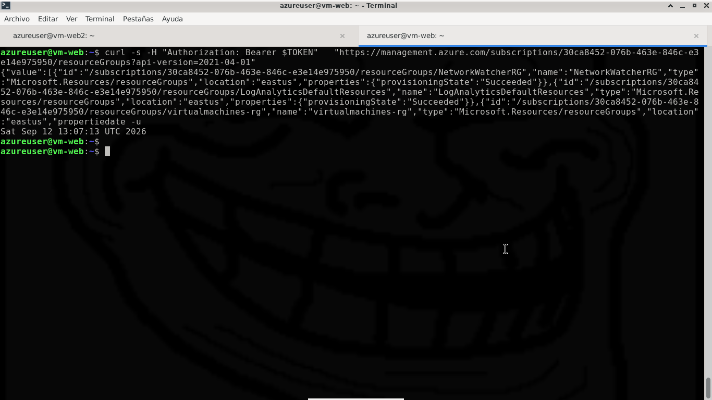
*Figure 3. Stolen bearer token used to enumerate resource groups across the subscription.*

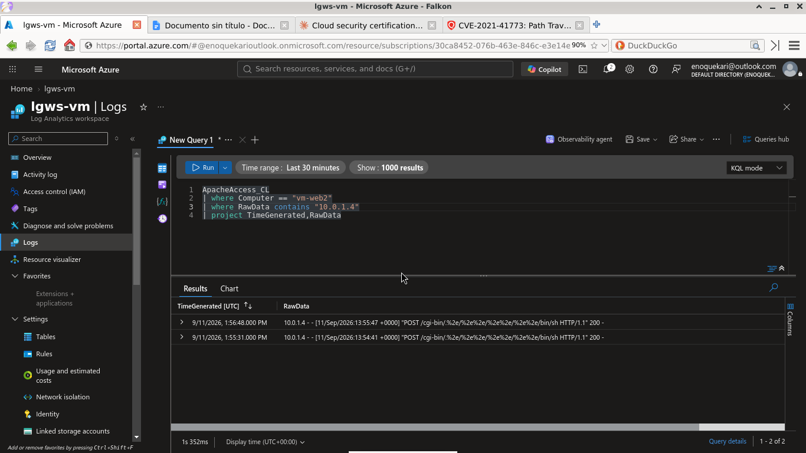
*Figure 4. Log Analytics (KQL) query surfacing the exploit requests in vm-web2's Apache access log, used during log-based corroboration of the timeline.*

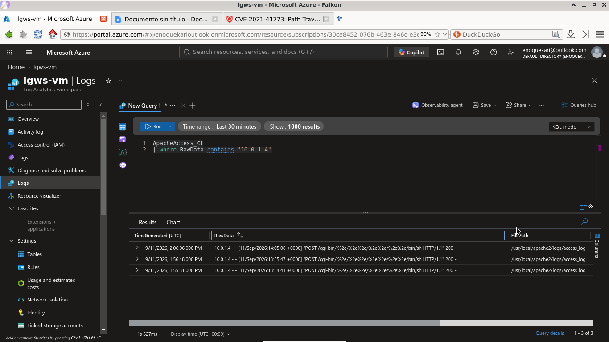
*Figure 5. Log Analytics query results confirming repeated exploitation attempts against vm-web2, including source IP and request path.*

### 4.3 Discovery — Resource Enumeration

The stolen ARM-scoped token was used to enumerate resources, resource groups, and role assignments visible to the managed identity, revealing the subscription-wide Contributor scope and the second, otherwise-unreachable resource (**MITRE ATT&CK T1580 — Cloud Infrastructure Discovery**).

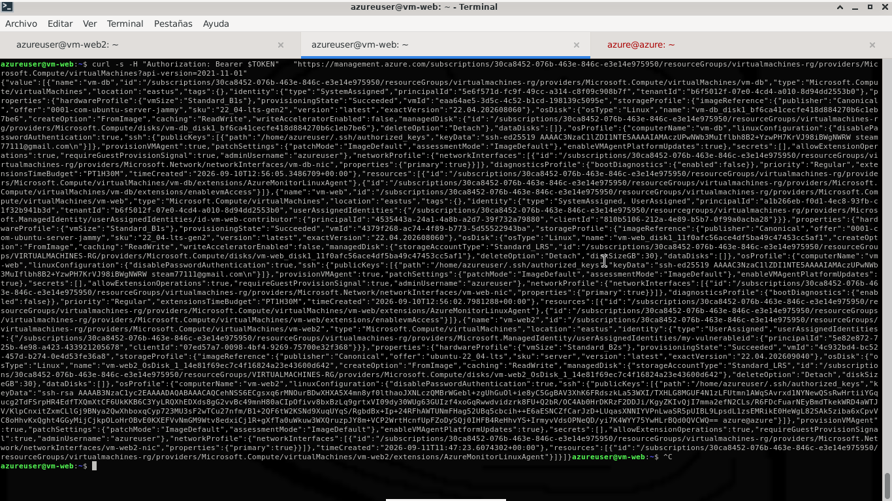
*Figure 6. Enumeration of subscription resources using the stolen managed-identity token.*

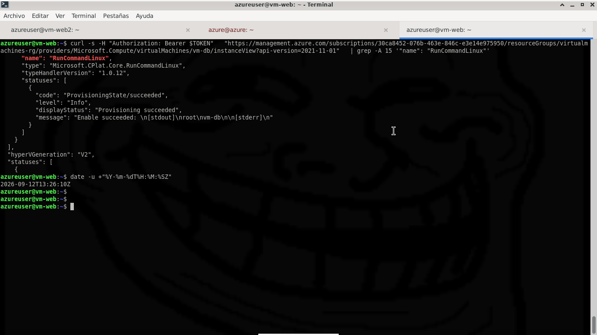
*Figure 7. A second OAuth token obtained for use against the lateral-movement target.*

### 4.4 Lateral Movement and Persistence

Using the stolen managed identity token, a new SSH keypair was generated on the attacker's foothold (vm-web) and the public key was injected into the target host's `/root/.ssh/authorized_keys` via Azure's RunCommandLinux extension API — all without ever directly connecting to the target or needing its credentials. The existing VM extension was deleted first to avoid conflicts, then reinstalled with the key-injection command running as root.

This establishes durable persistence (**MITRE ATT&CK T1098.004 — SSH Authorized Keys**) independent of the original token: even if the stolen credential is revoked or expires, the attacker retains direct SSH root access to the lateral-movement target indefinitely.

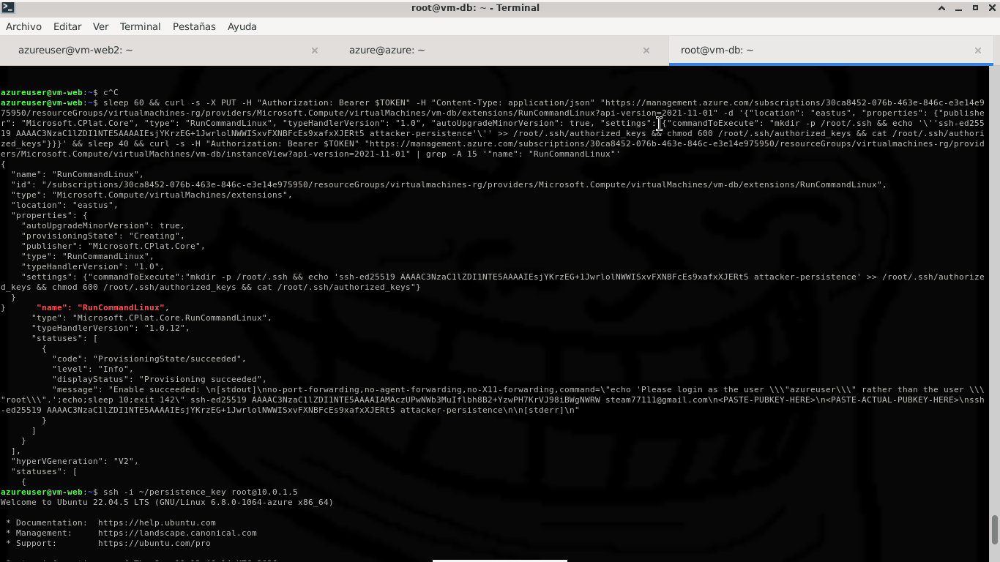
*Figure 8. RunCommandLinux extension invoked to inject the attacker's SSH public key as root.*

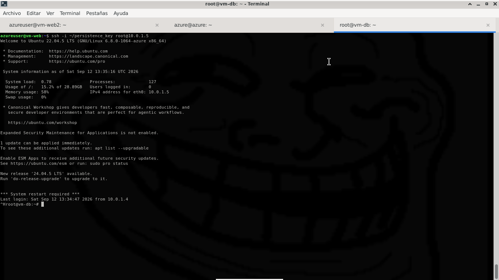
*Figure 9. Extension provisioning result confirming successful key injection.*

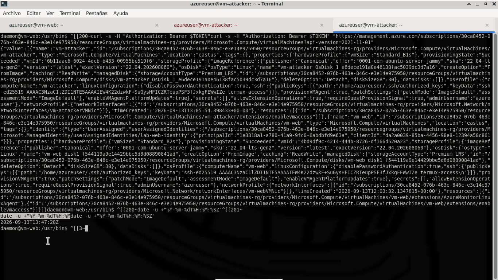
*Figure 10. Token acquisition and enumeration repeated against the second host.*

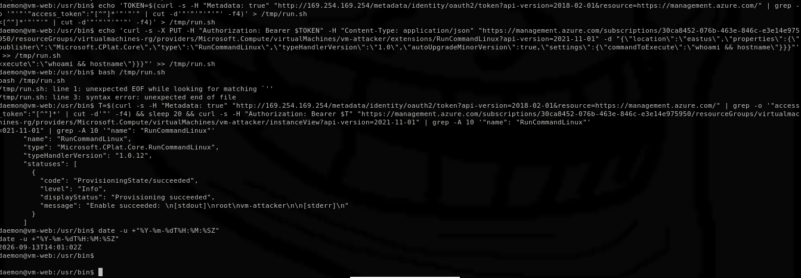
*Figure 11. RunCommand execution completes — provisioning succeeded.*

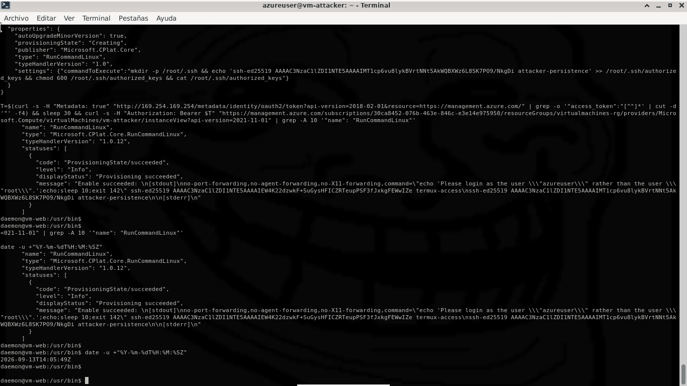
*Figure 12. Persistence confirmed via direct root SSH login to the lateral-movement target.*

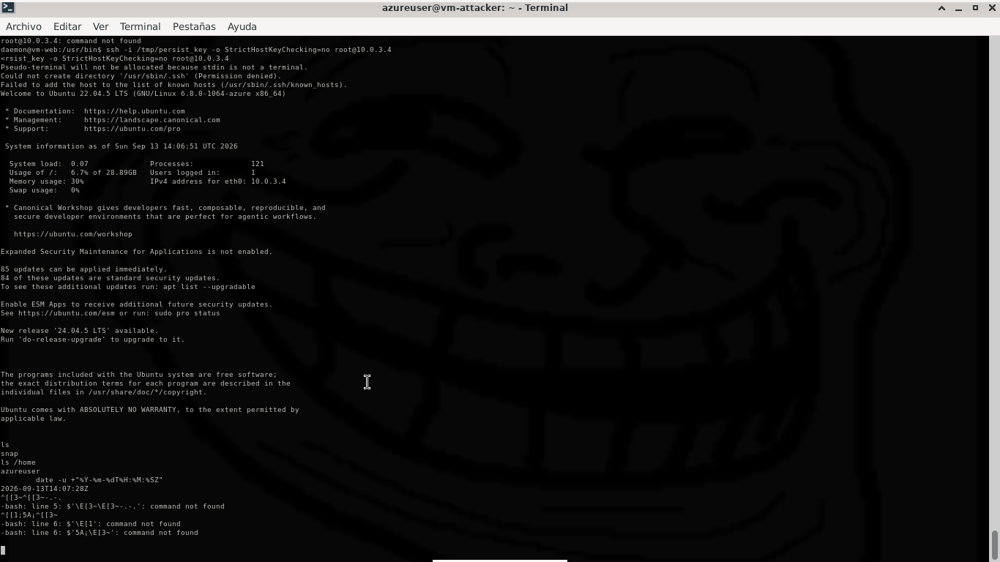
*Figure 13. Persistence fully confirmed — attacker-controlled key present in authorized_keys.*

### 4.5 Exfiltration

The final stage of the attack chain was data exfiltration (**MITRE ATT&CK T1530 — Data from Cloud Storage**). Using a second OAuth token obtained from the IMDS, this time scoped to `https://storage.azure.com/` instead of the ARM API, the attacker accessed a blob storage account (`labexfilstorage`) that was reachable only because the managed identity had been granted Storage Blob Data Reader at the subscription level.

The sensitive file (`sensitive.txt`) was downloaded directly from the `sensitive-data` container using the stolen token as a bearer credential, then immediately forwarded via an HTTP POST to an external endpoint (webhook.site) simulating attacker-controlled infrastructure.

The entire exfiltration required no additional exploitation — the over-permissioned managed identity, compromised in the initial access phase, provided all the access needed to reach, read, and exfiltrate data from a storage resource completely separate from the original victim VM. This confirms the full blast radius of the Contributor-level misconfiguration across the subscription.

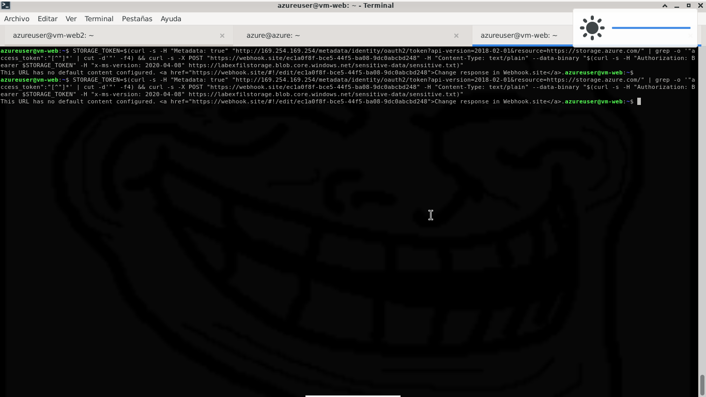
*Figure 14. Sensitive file retrieved from blob storage using the stolen storage-scoped token.*

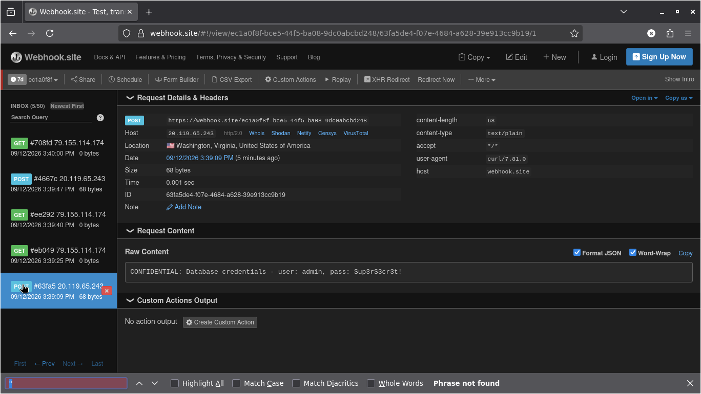
*Figure 15. Exfiltration of the sensitive file to an external, attacker-controlled endpoint.*

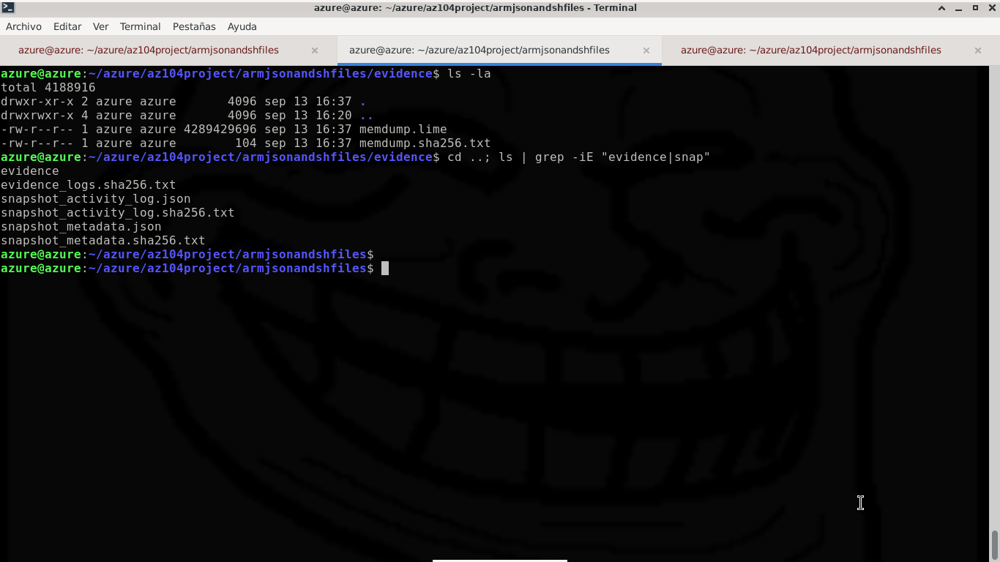
*Figure 16. SFTP session used to stage and retrieve remaining files of interest.*

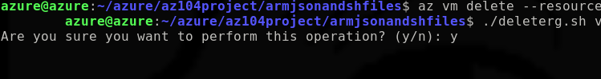
*Figure 17. Clean-up: the compromised virtual machine deleted at the conclusion of the exercise.*

## 5. Evidence Capture

Evidence was collected in order of volatility — memory first, then disk, then cloud control-plane logs — with a SHA-256 hash generated immediately after each artifact was collected to preserve chain of custody.

### 5.1 Memory Acquisition — vm-web2

```bash
uname -r
sudo apt update && sudo apt install -y linux-headers-$(uname -r) build-essential git
git clone https://github.com/504ensicsLabs/LiME.git
cd LiME/src && make
sudo mkdir -p /home/azureuser/evidence
sudo insmod lime-$(uname -r).ko "path=/home/azureuser/evidence/memdump.lime format=lime"
sha256sum /home/azureuser/evidence/memdump.lime | tee /home/azureuser/evidence/memdump.sha256.txt
sudo rmmod lime
```

### 5.2 Web Server Log Collection — vm-web2

```bash
sudo cp /usr/local/apache2/logs/access_log /home/azureuser/evidence_access_log.txt
sudo cp /usr/local/apache2/logs/error_log /home/azureuser/evidence_error_log.txt
sha256sum evidence_access_log.txt evidence_error_log.txt
```

### 5.3 Disk Snapshot — vm-web2

```bash
az vm show --resource-group virtualmachines-rg --name vm-web2 \
  --query "storageProfile.osDisk.managedDisk.id" -o tsv

az snapshot create \
  --resource-group virtualmachines-rg \
  --name vm-web2-evidence-snapshot-$(date +%Y%m%d%H%M) \
  --source "<disk-id-from-above>" \
  --sku Standard_LRS

az snapshot show \
  --resource-group virtualmachines-rg \
  --name <snapshot-name> \
  --query "{Name:name, TimeCreated:timeCreated, DiskSizeGB:diskSizeGb, ProvisioningState:provisioningState, Id:id}" \
  -o json > snapshot_metadata.json

sha256sum snapshot_metadata.json | tee snapshot_metadata.sha256.txt
```

### 5.4 Cloud Activity Log Export — vm-web2

```bash
az monitor activity-log list \
  --resource-group virtualmachines-rg \
  --start-time <snapshot-creation-time> \
  --caller <your-account-email> \
  -o json > snapshot_activity_log.json

sha256sum snapshot_activity_log.json | tee snapshot_activity_log.sha256.txt
```

### 5.5 Memory Acquisition — vm-web

```bash
uname -r
sudo apt update && sudo apt install -y linux-headers-$(uname -r) build-essential git
git clone https://github.com/504ensicsLabs/LiME.git
cd LiME/src && make
sudo mkdir -p /home/azureuser/evidence
sudo insmod lime-$(uname -r).ko "path=/home/azureuser/evidence/memdump.lime format=lime"
```

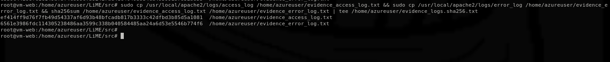
*Figure 18. Completed memory capture and log evidence collection on vm-web.*

### 5.6 Disk Snapshot — vm-web

```bash
DISK_ID=$(az vm show --resource-group virtualmachines-rg --name vm-web \
  --query "storageProfile.osDisk.managedDisk.id" -o tsv)

SNAPSHOT_NAME=vm-web-evidence-snapshot-$(date +%Y%m%d%H%M)

az snapshot create --resource-group virtualmachines-rg --name $SNAPSHOT_NAME \
  --source "$DISK_ID" --sku Standard_LRS

az snapshot show --resource-group virtualmachines-rg --name $SNAPSHOT_NAME \
  --query "{Name:name, TimeCreated:timeCreated, DiskSizeGB:diskSizeGb, ProvisioningState:provisioningState, Id:id}" \
  -o json > snapshot_metadata.json

sha256sum snapshot_metadata.json | tee snapshot_metadata.sha256.txt
```

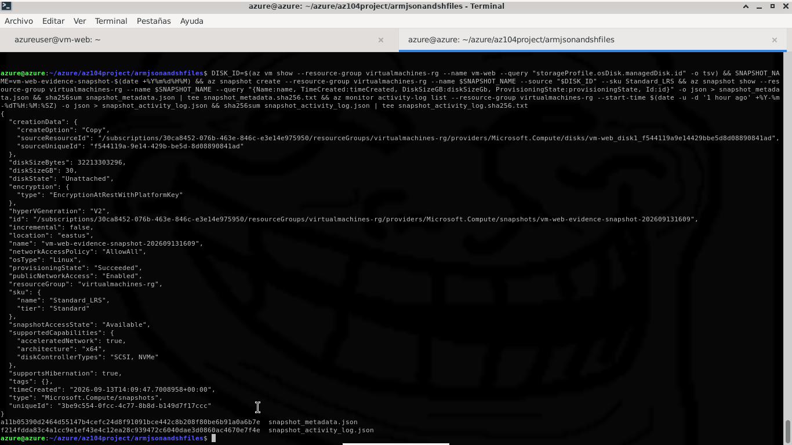
*Figure 19. Disk ID lookup, snapshot creation, metadata export, and hashing for vm-web.*

### 5.7 Cloud Activity Log Export — vm-web

```bash
az monitor activity-log list --resource-group virtualmachines-rg \
  --start-time $(date -u -d '1 hour ago' +%Y-%m-%dT%H:%M:%SZ) -o json > snapshot_activity_log.json

sha256sum snapshot_activity_log.json | tee snapshot_activity_log.sha256.txt
```

### 5.8 Snapshot Summary — vm-web

- **Name:** vm-web-evidence-snapshot-202609131609
- **Created:** 2026-09-13T14:09:47Z
- **Size:** 30 GB
- **Status:** Succeeded

## 6. Master Timeline (Correlated)

Memory, disk, and cloud-log artifacts were correlated into a single master timeline spreadsheet, aligning attacker-reported action times against the corresponding SIEM/EDR alert timestamps to compute detection latency for each attack stage.

Master timeline workbook: [master_timeline-2](https://docs.google.com/spreadsheets/d/1awtuTUinkCJRYYuhrq6Tz_ShA85DgcfLzas7uhToUdw/edit)

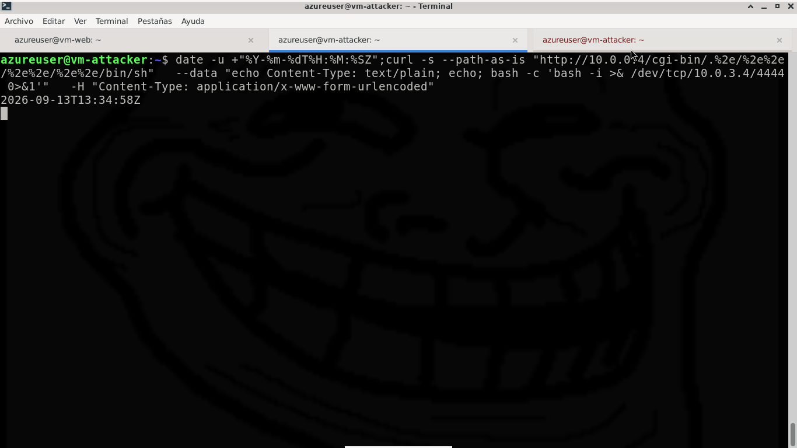
*Figure 20. Master timeline spreadsheet correlating attacker actions with detection events.*

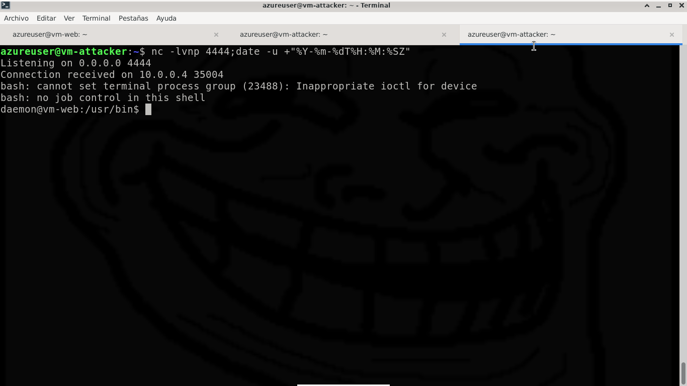
*Figure 21. Master timeline (continued).*

## 7. MITRE ATT&CK Mapping

| Stage | Technique | ID |
|---|---|---|
| Initial Access | Exploit Public-Facing Application (Apache CVE-2021-41773/42013) | T1190 |
| Credential Access | Cloud Instance Metadata API (IMDS token theft) | T1552.005 |
| Discovery | Cloud Infrastructure Discovery | T1580 |
| Lateral Movement / Execution | Cloud Administration Command (RunCommandLinux) | T1651 |
| Persistence | SSH Authorized Keys | T1098.004 |
| Exfiltration | Data from Cloud Storage | T1530 |
| Exfiltration | Exfiltration Over Web Service (webhook.site) | T1567 |

## 8. Detection Gap Analysis

For each technique above, SIEM/EDR alert timestamps should be compared against the ground-truth attacker action times recorded in the master timeline to determine whether an alert fired, and if so, the delay between action and detection. Based on the alerts captured during this exercise, complete the table below:

| Technique (ID) | Alert Fired? | Detection Latency | Notes |
|---|---|---|---|
| T1190 – Exploit Public-Facing App | TBD | TBD | Confirm Apache/WAF or IDS coverage for CGI path traversal |
| T1552.005 – IMDS Token Theft | TBD | TBD | Confirm Entra sign-in log alerting on managed identity token issuance |
| T1580 – Cloud Infrastructure Discovery | TBD | TBD | Confirm ARM read-operation anomaly detection |
| T1651 – Cloud Administration Command | TBD | TBD | Confirm alerting on RunCommand extension invocation |
| T1098.004 – SSH Authorized Keys | TBD | TBD | Confirm host-based file integrity monitoring on authorized_keys |
| T1530 / T1567 – Exfiltration | TBD | TBD | Confirm data loss prevention / egress monitoring coverage |

> **Note:** populate the "Alert Fired?" and "Detection Latency" columns from the SIEM console once alert query results for the incident window are exported.

## 9. Indicators of Compromise (IOCs)

| Type | Value | Context |
|---|---|---|
| Host | vm-web2 | Initial-access target; vulnerable Apache server exploited via CVE-2021-41773/42013 |
| Host | vm-web | Operator / foothold console used to catch the reverse shell and stage subsequent actions |
| Host | vm-db | Lateral-movement target; SSH persistence established via RunCommandLinux |
| Storage Account | labexfilstorage | Source of exfiltrated data |
| File | sensitive.txt | Exfiltrated file |
| External Endpoint | webhook.site | Simulated attacker-controlled exfiltration destination |
| Vulnerability | CVE-2021-41773 / CVE-2021-42013 | Apache HTTP Server 2.4.49 path traversal / RCE |
| Technique Artifact | IMDS token requests to 169.254.169.254 | Credential theft via cloud metadata service |

## 10. Chain of Custody

All evidence artifacts were hashed with SHA-256 immediately following collection. Recorded hashes for this exercise:

| Artifact | SHA-256 |
|---|---|
| snapshot_metadata.json | a11b05390d2464d55147b4cefc24d8f91091bce442c8b208f80be6b91a0a6b7e |
| snapshot_activity_log.json | f214fdda83c4a1cc9e1ef43e4c12ea28c939472c6040dae3d0860ac4670e7f4e |

Memory image and web-server-log hashes were generated at collection time per the commands in Section 5 and should be recorded in this table alongside the values above once confirmed from the evidence host.

## 11. Recommendations

- Scope the managed identity to the minimum resource group it needs, replacing the subscription-level Contributor assignment with a narrowly scoped custom role (principle of least privilege).
- Patch or replace the Apache HTTP Server build to close CVE-2021-41773/42013, and disable CGI execution where it is not required.
- Alert on IMDS token requests for high-privilege managed identities, particularly from workloads that do not normally call the ARM or Storage control planes.
- Monitor and alert on RunCommand/RunCommandLinux extension invocations, especially those that modify SSH authorized_keys or run as root.
- Enable file-integrity monitoring on authorized_keys and other persistence-relevant paths across production hosts.
- Restrict or monitor egress to unmanaged external endpoints (e.g., webhook.site and similar services) from workloads holding sensitive data access.
- Review all subscription-level role assignments for other identities with similarly excessive scope, since this misconfiguration pattern is unlikely to be isolated to one identity.

## 12. Conclusion

This exercise successfully reconstructed a complete attack chain — from initial exploitation of a vulnerable Apache server through credential theft, lateral movement, persistence, and exfiltration — using memory, disk, and cloud-log forensics. The root cause was a single over-scoped managed identity, which alone was sufficient to compromise a second, otherwise-isolated resource and exfiltrate its data. Completing the detection gap analysis in Section 8 against the SIEM/EDR alert data will indicate which stages of this chain are currently covered and where additional detection engineering is needed.
